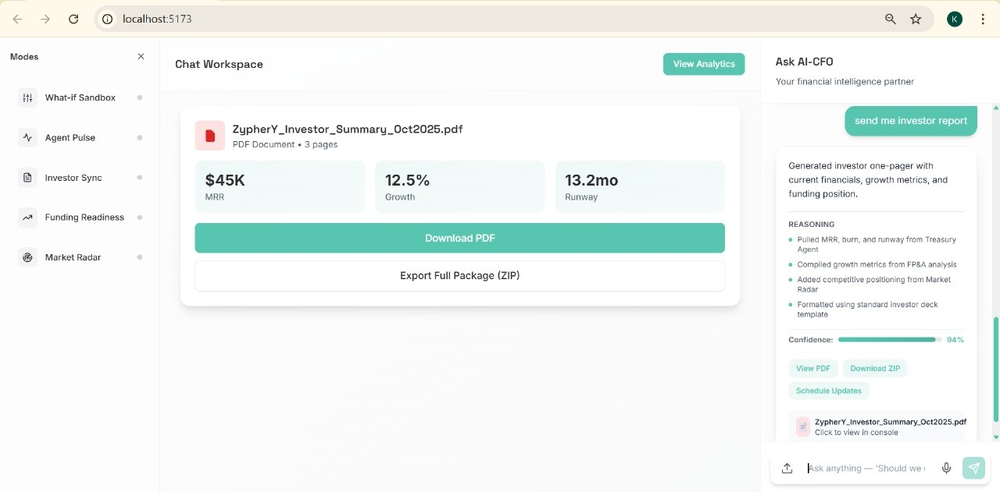
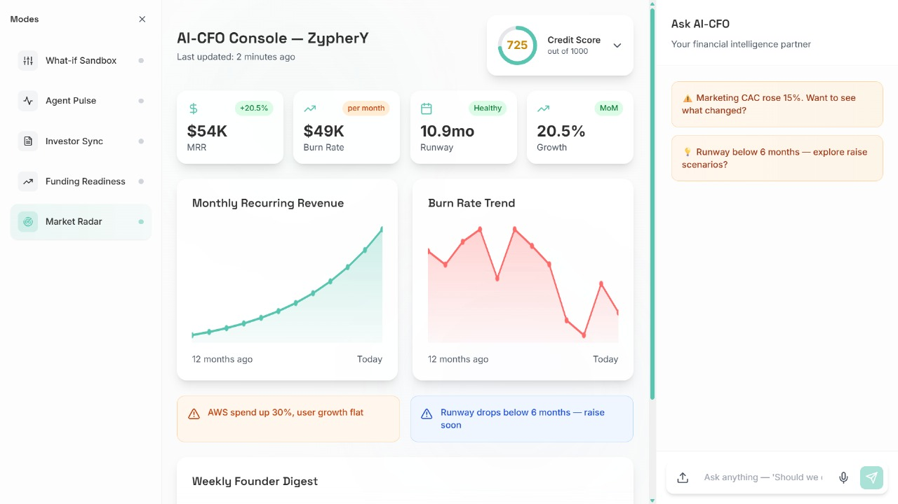
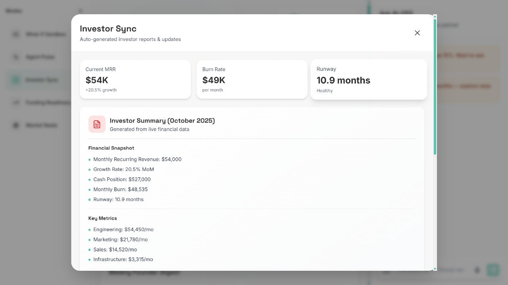

# 🤖 AI-CFO — Your Startup’s Financial Sixth Sense

> *Startups rarely fail because of bad ideas — they fail because they go financially blind.*

AI-CFO is an **autonomous finance co-founder** that runs accounting, cash flow planning, and investor updates — all by itself.  
It doesn’t just automate reports — it **thinks, acts, and communicates like a real CFO**.

---

## 🚀 Overview

Startups burn out juggling accounting, cash flow, and investor communication.  
Investors waste hours decoding messy spreadsheets. Both lose **clarity, trust, and time** — the three currencies of growth.

AI-CFO fixes that by becoming a **smart financial co-founder** that:
- Connects to your **bank, Notion, and accounting tools**  
- Runs **real-time planning, budgeting, and reporting**  
- Keeps **founders and investors perfectly in sync**  
- Builds a **financial credit system for startups** — a health index based on real performance  
- **Learns from the ecosystem** to make smarter financial decisions every day

---

## 🎥 Intro Video

> Get a feel for AI-CFO:
[](https://youtu.be/OP2IdZhzOvU "Introducing ZypherY ai-cfo")

---

## 🎥 Demo Video
> Get a feel for AI-CFO in action:
[](https://youtu.be/ijPLUVCrt6Q "Introducing ZypherY ai-cfo")

---


## 🖼️Demo Screenshots



Check out (https://github.com/Krishna-Parmar-001/ai_cfo_/tree/main/assets/demo) for more Demo Shoots.
---

## ⚙️ Tech Stack

| Layer | Technology |
|-------|-------------|
| **Frontend** | React |
| **Backend** | FastAPI (Python) |
| **Database** | MongoDB |
| **AI Layer** | OpenAI / Local LLM models |
| **Integration** | Bank, Notion, Accounting APIs |
---

## 🧠 Core Features (Differentiating Factors)

### 1️⃣ Acts, Not Reacts  
Instead of showing charts after damage is done, AI-CFO detects financial anomalies early — e.g.  
> “Spending up 30%, revenue steady — suggest delaying vendor payments by 10 days.”

### 2️⃣ Keeps Founders & Investors Aligned  
Investors get automatic, visual reports. Every AI insight is **traceable and source-linked** for transparency.

### 3️⃣ Builds a Startup Credit Network  
AI-CFO generates a **dynamic credit score** for each startup — helping investors spot rising stars early.

### 4️⃣ Grows Smarter With Ecosystem Data  
It learns from successful startups and recommends **cost-saving vendors** or **optimal burn strategies**.

### 5️⃣ Unified & Affordable  
All financial roles — accounting, FP&A, treasury, CFO — **merged into one autonomous AI system**.

---

## 💡 Business Model

- **Free for Startups** — access world-class finance insights at zero cost.  
- **Paid for Investors** — access verified, ranked startups via our AI-driven credit network.

We don’t charge founders to survive — we help investors find who’s worth backing.

---

## 🧩 Setup Instructions

### 1. Clone the Repository
```bash
git clone https://github.com/Krishna-Parmar-001/ai-cfo.git
cd ai-cfo

# 2.Backend setup(install dependency of each micro-service)
cd backend
pip install -r requirements.txt

# 3. Start the backend services:
uvicorn main:app --reload
```
🧠 Note:
For now, please use your own MongoDB connection string and OpenAI API key.
Create a .env file inside /backend:
```bash
MONGODB_URI="your_mongo_connection"
OPENAI_API_KEY="your_openai_key"
```

### You can check frontend without backend as well
#### Frontend Setup (React)
```bash
cd frontend
npm install
npm start
```

### Folder Structure
```
ai-cfo/
│
├── backend/
│   ├── main.py
│   ├── models/
│   ├── routes/
│   ├── services/
│   └── requirements.txt
│
├── frontend/
│   ├── src/
│   ├── public/
│   └── package.json
│
├── README.md
└── .env.example
```

### Vision
The future of finance isn’t just automated —
it’s autonomous, connected, and fair.


AI-CFO gives every founder the clarity of a CFO and every investor the truth behind the numbers — instantly.


### 🧑‍💻 Team

#### Harshil Gajjar
#### Dev Bheda
#### Deval Aal
#### Krishna Parmar
